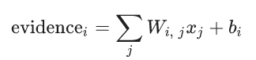
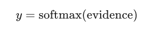
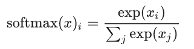
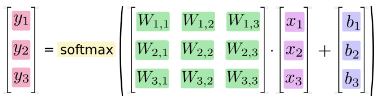
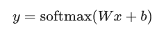

# 训练Mnist深度模型
[原文链接](https://www.tensorflow.org/get_started/mnist/pros)
在这篇笔记中，我们会对mnist数据集构建一个softmax回归模型和一个双层卷积神经网络模型。从而对tensorflow建模有一个基本的感觉。
## 一.mnist数据集
mnist数据集是一个手写数字识别数据集，被称为机器学习的果蝇。因为它很简单，使得人们可以在实验室中分析模型的特点。数据集大概长这样：

## 二.softmax建模
首先我们会建立一个简单的softmax模型。先来认识一下这个模型。
### softmax回归
在这里，我们将图片看作一个特征向量，该向量的每一个值都代表一个图片中一个像素的值。我们会构造一个线性模型，这已经是某种预测置信度了：

其中evidencei是指预测为第i个类标的置信度，模型对每一个类标都会输出一个evidence。
之后把这个线性模型喂给softmax函数，从而得到每一个类标的预测概率，这会使置信度拥有更好的性质：例如被正规化为概率，使得模型不容易被噪声影响等：


这里y是一个向量，向量的每一维代表一个类标的预测概率。画成下面这样会更直观

或者更紧凑的写成

**NOTE：如果感觉confused，你应该好好注意公式里符号的维度。**
### 使用tensorflow建模
注意tf中，我们需要先描述计算图，再执行计算图。下面我们会这么做。先准备好数据：
```
import tensorflow as tf
from tensorflow.examples.tutorials.mnist import input_data
print("downloading")
mnist = input_data.read_data_sets("MNIST_data/", one_hot=True)
print("finished")
```
定义好输入和模型参数：
```
#feature
x = tf.placeholder(tf.float32, [None, 784])
#label
y_ = tf.placeholder(tf.float32, [None, 10])
W = tf.Variable(tf.zeros([784, 10]))
b = tf.Variable(tf.zeros([10]))
```
建模，定义损失（交叉熵）和优化器（梯度下降）：
```
#[None, 10]
logit = tf.matmul(x, W) + b
cross_entropy = tf.reduce_mean(tf.nn.softmax_cross_entropy_with_logits(logits=logit, labels=y_))
train_step = tf.train.GradientDescentOptimizer(0.5).minimize(cross_entropy)
```
这里，
```cross_entropy = tf.reduce_mean(tf.nn.softmax_cross_entropy_with_logits(logits=logit, labels=y_))```
等价于
```cross_entropy = tf.reduce_mean(-tf.reduce_sum(y_ * tf.log(tf.nn.softmax(logit), reduction_indices=[1]))```
注意前者的参数尚未代入softmax函数。后者手动实现了交叉熵损失函数，前者比后者更稳定。我们应该使用前者。

执行计算图：
```
sess = tf.InteractiveSession()
tf.global_variables_initializer().run()
for i in range(1000):
    if(i % 100 == 0):
        print("iteration:" + str(i))
    batch_xs, batch_ys = mnist.train.next_batch(100)
    sess.run(train_step, feed_dict={x : batch_xs, y_: batch_ys})
```
度量模型：
```
correct_prediction = tf.equal(tf.argmax(logit,1), tf.argmax(y_,1))
accuracy = tf.reduce_mean(tf.cast(correct_prediction, tf.float32))
print(sess.run(accuracy, feed_dict={x: mnist.test.images, y_: mnist.test.labels}))
```
## 三.构造双隐层卷积网络
介绍卷积神经网络超出了本笔记的主题，这里只会介绍如何使用tf建模。首先定义两个函数用于构建权重和偏置。tf.truncated_normal会生成剪去过于趋向两边的值的正态分布。
```
def weight_variable(shape):
  initial = tf.truncated_normal(shape, stddev=0.1)
  return tf.Variable(initial)

def bias_variable(shape):
  initial = tf.constant(0.1, shape=shape)
  return tf.Variable(initial)
```
再定义好卷积和池化的操作。w的shape一般为四维张量：[高度，宽度，输入通道，输出通道]，这等于定义了一组卷积核，数量是输出通道的数量。而偏置一般是一维张量，shape是[输出通道]。输入的图片数据也是四维张量：[图片数量，图片高度，图片宽度，通道]。注意这里的通道数和第一层卷积的输入通道要一致。这里由于mnist是灰度图，因此输入通道数为1。strides对应的是在图片的四个维度上的步长。由此可知，pooling之后得到的特征图长宽均将为原来的一半。padding可以取两个值："VALID"和"SAME"，分别对应无padding和零padding。无padding情况下卷积会抛弃右/下的图片多余部分，而零padding会尝试在周围加上等长的0衬边。如果不能等长，右/下方会多出1。
```
def conv2d(x, W):
  return tf.nn.conv2d(x, W, strides=[1, 1, 1, 1], padding='SAME')

def max_pool_2x2(x):
  return tf.nn.max_pool(x, ksize=[1, 2, 2, 1],
                        strides=[1, 2, 2, 1], padding='SAME')
```
准备好数据：
```
mnist = input_data.read_data_sets('MNIST_data', one_hot = True)
#在TF中，认为[x,y]的shape是x*y的矩阵，每一行是一个样本
x = tf.placeholder(tf.float32, shape=[None, 784])
y_ = tf.placeholder(tf.float32, shape=[None, 10])
x_image = tf.reshape(x, [-1, 28, 28, 1])
```
构造模型：这个网络包含两层卷积，每层接着一个池化，之后将特征图展开到一维，又经过两层全连接，其中还引入了dropout以缓解过拟合，最后还会加入一层softmax。
```
#[-1,28,28,32]
h_conv1 = tf.nn.relu(conv2d(x_image, W_conv1) + b_conv1)
#[-1,14,14,32]
h_pool1 = max_pool_2x2(h_conv1)

W_conv2 = weight_variable([5,5,32,64])
b_conv2 = bias_variable([64])

#[-1,14,14,64]
h_conv2 = tf.nn.relu(conv2d(h_pool1, W_conv2) + b_conv2)
#[-1,7,7,64]
h_pool2 = max_pool_2x2(h_conv2)

W_fc1 = weight_variable([7*7*64, 1024])
b_fc1 = bias_variable([1024])

h_pool2_flat = tf.reshape(h_pool2, [-1, 7*7*64])
#[-1,1024]
h_fc1 = tf.nn.relu(tf.matmul(h_pool2_flat, W_fc1) + b_fc1)

keep_prob = tf.placeholder(tf.float32)
h_fc1_drop = tf.nn.dropout(h_fc1, keep_prob)

W_fc2 = weight_variable([1024, 10])
b_fc2 = bias_variable([10])

h_fc2 = tf.matmul(h_fc1_drop, W_fc2) + b_fc2
```
定义损失和度量指标
```
cross_entropy = tf.nn.softmax_cross_entropy_with_logits(logits=h_fc2, labels=y_)
train_step = tf.train.AdamOptimizer(1e-4).minimize(cross_entropy)
#[None]
correct_prediction = tf.equal(tf.argmax(h_fc2, 1), tf.argmax(y_, 1))
accuracy = tf.reduce_mean(tf.cast(correct_prediction, tf.float32))
```
执行计算图，这里的eval函数和sesson的run函数类似，都是执行图的某一结点：
```
with tf.Session() as sess:
  sess.run(tf.global_variables_initializer())
  for i in range(20000):
    batch = mnist.train.next_batch(50)
    if i % 100 == 0:
      train_accuracy = accuracy.eval(feed_dict={
          x: batch[0], y_: batch[1], keep_prob: 1.0})
      print('step %d, training accuracy %g' % (i, train_accuracy))
    train_step.run(feed_dict={x: batch[0], y_: batch[1], keep_prob: 0.5})

  print('test accuracy %g' % accuracy.eval(feed_dict={
      x: mnist.test.images, y_: mnist.test.labels, keep_prob: 1.0}))
```
## 四.使用tf.contrib.learn构造深度模型
tf.contrib.learn是高层API，可以用更精简的代码构造模型。下面的代码十分容易理解：
```
from __future__ import absolute_import
from __future__ import division
from __future__ import print_function

import os
import urllib.request

import numpy as np
import tensorflow as tf

# Data sets
IRIS_TRAINING = "iris_training.csv"
IRIS_TRAINING_URL = "http://download.tensorflow.org/data/iris_training.csv"

IRIS_TEST = "iris_test.csv"
IRIS_TEST_URL = "http://download.tensorflow.org/data/iris_test.csv"

def main():
  # If the training and test sets aren't stored locally, download them.
  if not os.path.exists(IRIS_TRAINING):
    raw = urllib.request.urlopen(IRIS_TRAINING_URL).read()
    with open(IRIS_TRAINING, "w") as f:
      f.write(raw)

  if not os.path.exists(IRIS_TEST):
    raw = urllib.request.urlopen(IRIS_TEST_URL).read()
    with open(IRIS_TEST, "w") as f:
      f.write(raw)

  # Load datasets.
  training_set = tf.contrib.learn.datasets.base.load_csv_with_header(
      filename=IRIS_TRAINING,
      target_dtype=np.int,
      features_dtype=np.float32)
  test_set = tf.contrib.learn.datasets.base.load_csv_with_header(
      filename=IRIS_TEST,
      target_dtype=np.int,
      features_dtype=np.float32)

  # Specify that all features have real-value data
  feature_columns = [tf.contrib.layers.real_valued_column("", dimension=4)]

  # Build 3 layer DNN with 10, 20, 10 units respectively.
  classifier = tf.contrib.learn.DNNClassifier(feature_columns=feature_columns,
                                              hidden_units=[10, 20, 10],
                                              n_classes=3,
                                              model_dir="/tmp/iris_model")
  # Define the training inputs
  def get_train_inputs():
    x = tf.constant(training_set.data)
    y = tf.constant(training_set.target)

    return x, y

  # Fit model.
  classifier.fit(input_fn=get_train_inputs, steps=2000)

  # Define the test inputs
  def get_test_inputs():
    x = tf.constant(test_set.data)
    y = tf.constant(test_set.target)

    return x, y

  # Evaluate accuracy.
  accuracy_score = classifier.evaluate(input_fn=get_test_inputs,
                                       steps=1)["accuracy"]

  print("\nTest Accuracy: {0:f}\n".format(accuracy_score))

  # Classify two new flower samples.
  def new_samples():
    return np.array(
      [[6.4, 3.2, 4.5, 1.5],
       [5.8, 3.1, 5.0, 1.7]], dtype=np.float32)

  predictions = list(classifier.predict(input_fn=new_samples))

  print(
      "New Samples, Class Predictions:    {}\n"
      .format(predictions))

if __name__ == "__main__":
    main()
```